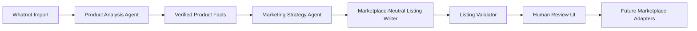

# Whatnot to Etsy AI Listing Generator

This project is a local-first AI workflow for resale and ecommerce listing preparation. It imports Whatnot listings, analyzes product facts with a local multimodal model, creates a separate marketing strategy, generates a marketplace-neutral listing draft, validates the output, and keeps a human reviewer as the final approval gate.

## AI Workflow



## Current Architecture Highlights

- Local LLM integration through LM Studio using OpenAI-compatible APIs.
- Multimodal product analysis with listing text plus cached images.
- Separate AI responsibilities for product facts, marketing positioning, writing, and validation.
- Structured outputs enforced with Pydantic models.
- Prompt files with explicit prompt versions.
- AI execution logging for observability and debugging.
- Human-in-the-loop review with editable strategy and draft fields.

## Current Features

- Import listing links from a Whatnot storefront using Selenium.
- Parse key listing fields from each listing page:
  - source URL
  - title
  - price
  - size
  - condition
  - description notes
  - image URLs
- Save items to a local SQLite database.
- Update existing rows when a listing already exists (deduped by source URL).
- Show saved items in the FastAPI/Jinja UI.
- Add manual review notes when title/description garment signals conflict.
- Run a local AI workflow with:
   - Product Analysis Agent
   - Marketing Strategy Agent
   - Marketplace-neutral Listing Writer
   - Listing Validator
- Review AI workflow metadata including model and prompt version on the item page.
- Regenerate marketing strategy and listing draft independently.
- Log AI executions per step for observability.

## Local AI Models

- `Qwen2.5-VL-7B-Instruct` via LM Studio for product analysis, strategy generation, draft generation, and validation.
- `FLUX.2 klein 4B` via ComfyUI for optional image enhancement workflows.

Each AI task is configurable independently with environment variables, so the architecture can demonstrate model abstraction without requiring multiple models to be loaded at once.

## Planned Features

- Deterministic marketplace adapters for Etsy, eBay, Poshmark, and Mercari.
- Stronger validation and evaluation fixtures.
- Portfolio-focused screenshots and architecture notes.

## Not Yet Implemented

The following are intentionally not implemented in this release:

- Etsy OAuth and API publishing.
- Automatic upload to Etsy or any marketplace.
- Multi-platform publishing orchestration.
- Live marketplace research tools or autonomous tool-using agents.
- Production queue/worker architecture for long-running imports.
- Automated end-to-end scraper test suite.

## Platform Support

This release officially targets Windows users only.

## Prerequisites (Windows)

- Windows 10 or Windows 11
- Python 3.11+
- Google Chrome
- ChromeDriver (manual install required)

## Quick Start (Copy/Paste)

After you install ChromeDriver and confirm `chromedriver --version` works, run:

```powershell
git clone <your-repo-url>
cd whatnot-to-etsy-ai
python -m venv .venv
Set-ExecutionPolicy -Scope Process -ExecutionPolicy RemoteSigned
.\.venv\Scripts\Activate.ps1
pip install -r requirements.txt
Copy-Item .env.example .env
uvicorn app.main:app --reload
```

## ChromeDriver Installation (Required)

1. Check your installed Chrome version:
   - Open Chrome -> Settings -> About Chrome.
2. Download the matching ChromeDriver version from the Chrome for Testing downloads page.
3. Extract chromedriver.exe.
4. Move chromedriver.exe to a stable folder, for example:
   - C:\tools\chromedriver\chromedriver.exe
5. Add that folder to your Windows PATH:
   - System Properties -> Environment Variables -> Path -> New -> C:\tools\chromedriver
6. Close and reopen PowerShell/VS Code so PATH refreshes.
7. Verify installation:

```powershell
chromedriver --version
```

If this command fails, fix PATH before running the app.

## Setup and Run (PowerShell)

1. Clone the repository:

```powershell
git clone <your-repo-url>
cd whatnot-to-etsy-ai
```

2. Create and activate a virtual environment:

```powershell
python -m venv .venv
Set-ExecutionPolicy -Scope Process -ExecutionPolicy RemoteSigned
.\.venv\Scripts\Activate.ps1
```

3. Install dependencies:

```powershell
pip install -r requirements.txt
```

4. Create your local env file:

```powershell
Copy-Item .env.example .env
```

5. Start the app:

```powershell
uvicorn app.main:app --reload
```

6. Open the app in your browser:

- http://127.0.0.1:8000

7. Import flow:

- Paste a Whatnot storefront URL.
- Click Import Listings.
- Open `/items`.
- Cache/analyze images if needed.
- Click `Enhance with AI` to run the full workflow.
- Use `Regenerate Strategy` or `Regenerate Listing` to revise individual stages.
- Edit strategy, title, description, and keywords before approval.

## Manual Validation Script

A manual Selenium smoke script is included at:

- scripts/manual_selenium_check.py

This is a manual debugging helper, not an automated test suite.

## Review UI

The review page is designed to make the AI architecture visible:

- Original listing data
- Product Analysis output
- Marketing Strategy output
- Listing draft
- Validation results
- Workflow step metadata with prompt versions and model names

This is intentional. The project is meant to be portfolio-quality and understandable to another engineer inspecting the system.

## Troubleshooting

### ChromeDriver version mismatch

If Selenium fails to start Chrome, your ChromeDriver version likely does not match your Chrome version. Download the matching version and retry.

### chromedriver command not found

If chromedriver --version fails, PATH is not set correctly or your terminal has not been restarted after PATH changes.

### SQLite file path issues

By default, the app writes to:

- data/app.db

You can override this in .env with DATABASE_URL. Example:

- DATABASE_URL=sqlite:///data/app.db

## Project Status

Early-stage but production-minded local AI portfolio project focused on reliable import, review, structured AI workflows, and manual approval.
